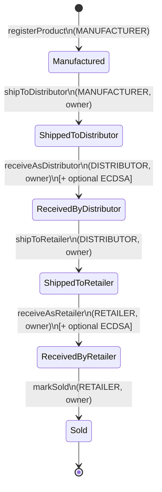

# Product State Machine

Every product progresses through a strict 6-state lifecycle. Transitions are enforced by
`_requireTransition(from, to)` in [`SupplyChain.sol`](../contracts/SupplyChain.sol).

## Invariants

1. **Linearity** — every transition advances exactly one step along the diagram. No skipping.
2. **Ownership transfer** — `currentOwner` is updated on each `shipToX` so the next role
   physically holds the product.
3. **Append-only history** — every transition appends one `HistoryEntry`. Nothing in the
   contract ever pops or rewrites a prior entry.
4. **Sold is terminal** — no transition exists out of `Sold`. The product cannot be
   "un-sold" or further shipped.
5. **Nonce monotonicity** — `_shipNonce[productId]` increments on every `shipToX`. Receipt
   signatures bind to the current nonce, so they cannot be replayed across legs.

## Failure modes (all revert with custom errors)

| Caller condition                       | Error                            |
|----------------------------------------|----------------------------------|
| Wrong role for the action              | `AccessControlUnauthorizedAccount` |
| Right role, wrong product owner        | `NotCurrentOwner`                |
| Calling out of order (e.g. ship twice) | `NotCurrentOwner` or `InvalidTransition` |
| Recipient lacks the destination role   | `AccessControlUnauthorizedAccount` |
| Recipient is `address(0)`              | `ZeroAddress`                    |
| Unknown product ID                     | `ProductNotFound`                |
| Bad signature on receipt               | `InvalidSignature`               |
